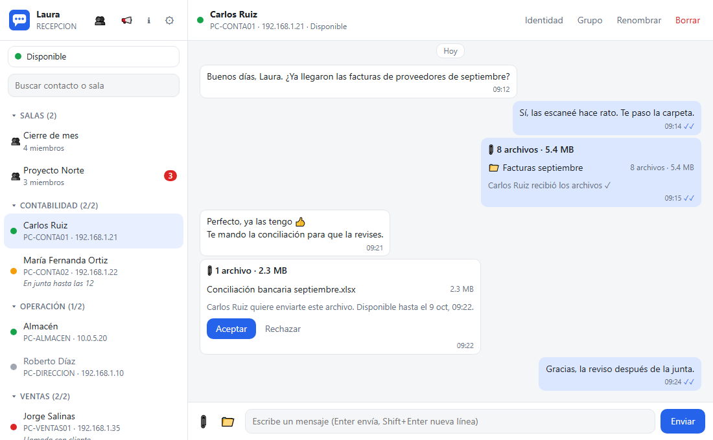
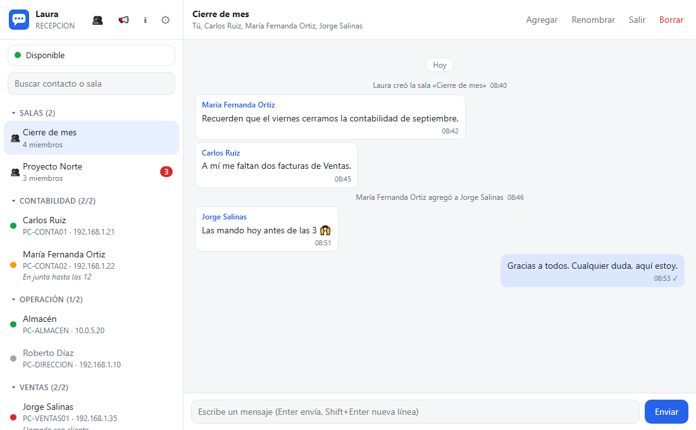
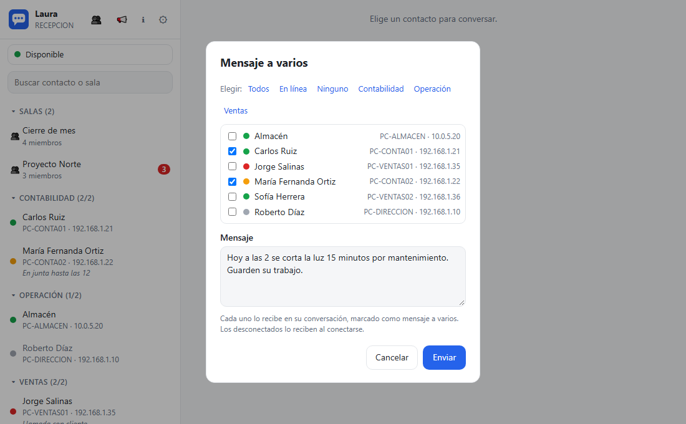
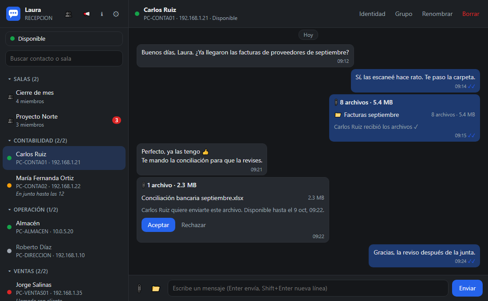

<p align="center">
  
</p>

<h1 align="center">LanChat</h1>

<p align="center">
  Mensajería y envío de archivos para la red local de la oficina.<br>
  Sin servidor, sin cuentas, sin Internet: se instala en cada PC y teléfono Android, y listo.
</p>

<p align="center">
  <a href="https://github.com/AEROGU/lanchat/releases/latest"></a>
  <a href="https://github.com/AEROGU/lanchat/actions/workflows/ci.yml"></a>
  <a href="LICENSE"></a>
  
  
</p>

<p align="center">
  
</p>

*[English summary below](#english).*

## Características

- **Sin servidor ni configuración**: las PCs de la red se encuentran solas. Las
  de otra subred se agregan una vez (por IP o nombre de equipo) y las demás
  las conocen a través de ella.
- **Sin cuentas**: cada quien elige su nombre; siempre se ve también el nombre
  del equipo y su IP. A cada contacto le puedes poner un alias y un grupo.
- **Mensajes** 1 a 1 con historial, entrega a los desconectados cuando se
  conectan, ✓ entregado y ✓✓ leído (desactivable).
- **Salas** de chat grupales y **mensajes a varios** contactos o a un grupo.
- **Archivos y carpetas** (botón o arrastrar y soltar): el otro debe
  aceptarlos, se descargan una sola vez, se reanudan si se corta la red y se
  verifican con SHA-256. Las imágenes (JPG, PNG, GIF, WebP) llegan con
  **vista previa** antes de aceptarlas y se abren completas con un clic.
- **Estados** Disponible, Ausente y Ocupado, con mensaje y ausente automático.
- **Cifrado** TLS 1.3 entre PCs, con aviso si la identidad de un equipo cambia.
- **Privacidad**: descargar una copia de tus datos o borrarlos (todos, o una
  conversación), por ejemplo cuando alguien deja la empresa.
- Icono en la bandeja del sistema, notificaciones de Windows, inicio con
  Windows, tema claro y oscuro. Un solo `.exe`, sin instalar nada más.

| Salas de chat | Mensaje a varios | Tema oscuro |
|---|---|---|
| [](docs/screenshots/sala.png) | [](docs/screenshots/mensaje-a-varios.png) | [](docs/screenshots/tema-oscuro.png) |

## Descargar

1. Descarga `LanChat-<versión>.zip` de la [última versión](https://github.com/AEROGU/lanchat/releases/latest).
2. Descomprímelo en una carpeta fija (p. ej. `C:\LanChat` o Documentos) y
   ejecuta `lanchat.exe`.
3. Cuando Windows lo pregunte, permite el acceso en **redes privadas**.
4. Repite en cada PC de la oficina.

Requisitos: Windows 10 u 11 de 64 bits con Microsoft Edge (viene con
Windows). La red debe estar marcada como **privada** en Windows y permitir
UDP 50000 y TCP 50001 entre las PCs.

### En Android

1. Descarga `LanChat-<versión>.apk` de la [última versión](https://github.com/AEROGU/lanchat/releases/latest)
   en el teléfono y ábrelo. Android pedirá permitir "instalar apps
   desconocidas" a la app con que lo abriste (navegador, Archivos…).
2. Al abrir LanChat, permite las **notificaciones** y, en el aviso de
   batería, elige **Continuar** y luego **Permitir**.
3. En **OPPO, Xiaomi, Huawei, Vivo** y similares: en LanChat, Ajustes > "la
   información de la app" > Uso de la batería, activa **Permitir actividad
   en segundo plano**. Si no, el teléfono congela LanChat con la pantalla
   apagada y los mensajes llegan tarde.

Requisitos: Android 7 o posterior, conectado al Wi-Fi de la oficina. Es la
misma interfaz que en la PC; LanChat arranca solo al encender el teléfono
(se desactiva en Ajustes) y se detiene desde su notificación. Para que los
teléfonos vean a las PCs con la pantalla apagada, las PCs deben tener la
misma versión o una posterior.

### Aviso de Windows SmartScreen

LanChat no está firmado con un certificado de firma de código (cuestan
dinero cada año). Por eso, la primera vez que se abre un `lanchat.exe`
descargado de Internet, Windows puede mostrar **"Windows protegió su PC"**.
Para abrirlo:

1. Haz clic en **Más información**.
2. Haz clic en **Ejecutar de todas formas**.

Solo hace falta la primera vez en cada PC. Descarga LanChat únicamente de la
página oficial del proyecto (https://github.com/AEROGU/lanchat). Para
comprobar que el zip no fue alterado, compara su SHA-256
(`Get-FileHash LanChat-<versión>.zip` en PowerShell) con el de
`SHA256SUMS.txt` de la misma versión, o compila tú mismo el código fuente
(ver [Compilar](#compilar)).

## Uso

`lanchat.exe` abre la ventana y queda en la bandeja del sistema (clic
izquierdo: abrir; clic derecho: menú con **Salir**). Cerrar la ventana no
cierra LanChat. Abrirlo de nuevo con LanChat ya abierto solo muestra la ventana.

La primera vez Windows pedirá permiso de red: hay que permitirlo en **redes
privadas** (UDP 50000 y TCP 50001). También se puede crear la regla desde
Ajustes > Firewall de Windows, o con `lanchat.exe -firewall add`.

En la primera ejecución se activa el inicio con Windows (en la bandeja); se
desactiva en Ajustes. Con `-dir` no se toca, para no reemplazar el de la
instalación normal.

Opciones:

| Opción | Uso |
|---|---|
| `-hidden` | arrancar solo en la bandeja (para el inicio con Windows) |
| `-dir carpeta` | otra carpeta de datos (por defecto `%APPDATA%\LanChat`) |
| `-version` | mostrar la versión |
| `-firewall add` / `remove` | crear o quitar la regla del Firewall de Windows (pide administrador) |

Para diagnóstico, `go tool mage debug` compila `dist/lanchat-debug.exe`, que
tiene consola:

| Opción | Uso |
|---|---|
| `-debug` | registro detallado en la consola en vez de `lanchat.log` |
| `-console` | usar LanChat desde la consola, sin ventana (`/ayuda` lista los comandos) |

## Seguridad

Toda la comunicación entre PCs (mensajes, archivos, avisos) va cifrada con
**TLS 1.3 mutuo**. Cada instalación crea su propia identidad (clave ECDSA
P-256 en `identity.key`) y los demás la reconocen por su **huella**:

- La primera vez que una PC ve a otra, guarda su huella (confianza en el
  primer uso, como SSH). Desde entonces solo se comunica con esa identidad.
- Si la huella cambia (reinstalaron LanChat, o alguien intenta hacerse pasar
  por esa PC), los envíos se detienen y la conversación muestra un aviso con
  **Confiar en la nueva identidad**.
- Las huellas se ven en el botón **Identidad** de cada conversación; para
  verificar, compáralas con la otra persona.
- El descubrimiento por UDP no va cifrado (nombre, hostname, estado y huella
  anunciados son visibles en la red), pero no permite suplantar a nadie: la
  conexión TLS comprueba la huella.
- Los archivos recibidos llevan la "marca de la Web" de Windows, como los
  descargados con un navegador, y LanChat pide confirmación antes de abrir
  programas o scripts.

Desde la 0.10 se usa el protocolo v2 (cifrado), que no se comunica con
versiones anteriores: hay que actualizar todas las PCs.

## Privacidad

En **Ajustes > Privacidad**:

- **Descargar mis datos**: guarda en Descargas una copia de `lanchat.db`
  (historial, contactos, salas y ofertas de archivos). Se abre con cualquier
  programa para SQLite, p. ej. DB Browser for SQLite.
- **Borrar todos mis datos** (p. ej. cuando alguien deja la empresa): sale de
  las salas avisando a los demás, cancela los archivos pendientes y borra las
  conversaciones, salas, alias y grupos de contactos, el nombre y el mensaje
  de estado. Pide escribir `BORRAR` para confirmar. Conserva la configuración
  de red y la identidad de la PC. Los archivos ya recibidos quedan en su
  carpeta.

Cada conversación (o sala) tiene además el botón **Borrar**: borra sus
mensajes y cancela los archivos pendientes con ese contacto; el contacto se
conserva. Borrar una sala de la que ya saliste la quita de la lista.

Lo borrado no queda recuperable en `lanchat.db`: la base usa `secure_delete`
(sobrescribe con ceros) y se vacía su registro (`-wal`). Borrar es solo en
esta PC: los demás conservan su copia de las conversaciones.

## Archivos en `%APPDATA%\LanChat`

| Archivo | Contenido |
|---|---|
| `config.json` | ID del equipo, nombre, puertos, equipos de otras subredes |
| `identity.key`, `identity.crt` | identidad de esta PC; no copiarlos a otra PC (si se borran, los demás verán "identidad cambió") |
| `lanchat.db` | contactos, alias e historial (SQLite) |
| `lanchat.log` | registro (se rota al pasar de 1 MB); no guarda mensajes |
| `ui.json` | puerto y token de la ventana; existe mientras LanChat está abierto |
| `icon.png` | icono que usan las notificaciones |
| `edge\` | perfil de Edge de la ventana de LanChat |

## Compilar

Requiere Go (la versión indicada en `go.mod`). Mage, staticcheck y govulncheck
se instalan solos como herramientas del módulo (`tool` en `go.mod`), no hace
falta nada más.

```bash
go tool mage              # lista los targets con su descripción
go tool mage build        # compila dist/lanchat.exe (sin consola)
go tool mage debug        # compila dist/lanchat-debug.exe, con consola
go tool mage check        # gofmt, go vet, staticcheck, compilación para Android y pruebas: antes de cada commit
go tool mage race         # pruebas con detector de carreras (requiere gcc)
go tool mage vuln         # vulnerabilidades conocidas en el código y sus librerías
go tool mage dist         # dist/LanChat-<versión>.zip (exe, LEEME, licencia, avisos) y SHA256SUMS.txt
go tool mage screenshots  # regenera docs/screenshots y docs/logo.png (requiere Edge)
go tool mage android      # android/app/libs/lanchat.aar para la app de Android (en desarrollo, ver docs/ANDROID.md)
go tool mage apk          # dist/LanChat-<versión>-debug.apk para probar en el teléfono (firma de depuración)
go tool mage apkRelease   # dist/LanChat-<versión>.apk firmado con la clave propia (ver docs/ANDROID.md)
```

`build` genera antes `cmd/lanchat/rsrc_windows_amd64.syso` (ícono, versión y
manifest del .exe, target `resources`); el archivo no se versiona. El texto de
`LEEME.txt` del zip está en `packaging/LEEME.txt`.

La versión del ejecutable sale de `git describe`: la etiqueta `v1.0.0` da la
versión 1.0.0.

Las capturas de pantalla se hacen con la interfaz real y una oficina de
demostración con datos ficticios (`internal/ui/demo_test.go`), así que se
pueden regenerar cuando cambie la interfaz. El diseño y el protocolo están
en [PLAN.md](PLAN.md).

### GitHub Actions

- `.github/workflows/ci.yml`: en cada push a `main` o `develop` y en cada
  pull request corre `check`, `race`, `vuln` y `build` en Windows, y compila
  el APK de prueba en Ubuntu.
- `.github/workflows/release.yml`: al subir una etiqueta `vX.Y.Z` verifica
  todo, arma el zip, compila el APK firmado (con la clave de los *secrets*,
  ver [docs/ANDROID.md](docs/ANDROID.md#clave-de-firma)) y crea la Release
  con los dos y `SHA256SUMS.txt`. El texto de la Release es el mensaje de la
  etiqueta:

  ```bash
  git tag -a v1.0.0 -m "LanChat 1.0.0: lo nuevo de esta versión"
  git push origin v1.0.0
  ```

- `.github/dependabot.yml`: pull requests semanales con las versiones nuevas
  de las librerías de Go, de las acciones y de la app de Android.

## Licencia

Copyright © 2026 Arturo Enrique Rosas Gutiérrez.

LanChat es software libre: puedes usarlo, estudiarlo, modificarlo y
redistribuirlo bajo los términos de la **Licencia Pública General de GNU,
versión 3** (GPL v3), publicada por la Free Software Foundation. Quien
distribuya LanChat o una versión modificada debe conservar este aviso y la
mención del autor original, y publicar el código fuente bajo la misma
licencia.

Se distribuye con la esperanza de que sea útil, pero **sin ninguna
garantía**, ni siquiera la implícita de comerciabilidad o de idoneidad para
un propósito particular. Ver el texto completo en [LICENSE](LICENSE).

Las librerías de terceros incluidas en el ejecutable (todas con licencias
BSD, MIT o Apache 2.0, compatibles con la GPL v3) se listan con sus avisos
en `THIRD_PARTY_NOTICES.txt`, que genera `go tool mage notices` y se incluye
en el zip.

## English

LanChat is a serverless LAN messenger and file-sharing app for Windows 10/11
and Android 7+, similar to classic office LAN messengers. Devices discover
each other automatically (UDP broadcast and unicast, plus manually added
peers for other subnets), with no accounts and no Internet connection.
Features: one-to-one chat with offline delivery and read receipts, group
rooms, broadcast messages, file and folder transfers that must be accepted
(one-time download, resumable, SHA-256 verified) with image previews,
presence status, mutual TLS 1.3 with trust-on-first-use identity pinning,
and options to export or securely wipe your data. On Windows it is a single
executable written in Go, with a local web UI shown in an Edge app window
and a system tray icon; on Android the same Go core (via gomobile) runs in a
foreground service and the same UI in a WebView. The interface is in Spanish.
Licensed under the GPL v3.
